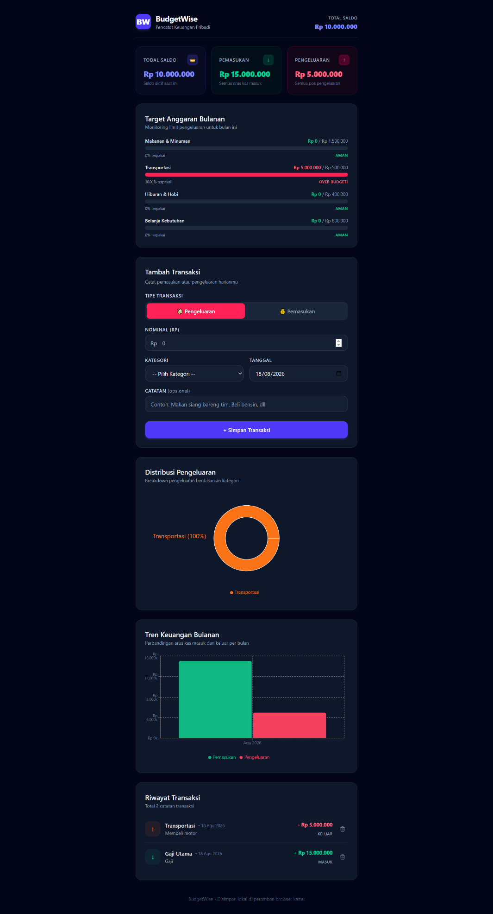

# 💰 BudgetWise

Aplikasi pencatat keuangan pribadi — catat pemasukan dan pengeluaran, kelompokkan berdasarkan kategori, pantau limit budget, dan visualisasikan pola keuangan lewat grafik interaktif.

> 📸 **Screenshot:** 

## ✨ Fitur

- ➕ **Catat transaksi** — pemasukan maupun pengeluaran, lengkap dengan validasi form
- 🏷️ **Kategori transaksi** — kelompokkan berdasarkan jenis pengeluaran/pemasukan
- 📊 **Ringkasan keuangan** — total pemasukan, pengeluaran, dan saldo berjalan
- 🥧 **Grafik breakdown kategori** (pie chart) — lihat proporsi pengeluaran per kategori
- 📈 **Grafik tren bulanan** (bar chart) — bandingkan pemasukan vs pengeluaran antar bulan
- 🎯 **Progress budget** — pantau batas pengeluaran per kategori dengan indikator visual (aman/mendekati batas/melebihi batas)
- 📝 **Riwayat transaksi** — daftar transaksi lengkap dengan opsi hapus
- 💾 **Tersimpan otomatis** — seluruh data persisten di perangkat, tanpa perlu akun atau server

## 🛠️ Tech Stack

| Kategori | Teknologi |
|---|---|
| Library | React 19 |
| Styling | Tailwind CSS v4 |
| Manajemen Form | React Hook Form |
| Validasi Skema | Zod |
| Grafik | Recharts |
| Animasi | Framer Motion |
| Build tool | Vite |
| Penyimpanan | Browser `localStorage` |

## 🧠 Konsep React yang Diterapkan

- **React Hook Form + Zod** — validasi form dideklarasikan lewat skema, bukan logic manual per-field; form bersifat *uncontrolled* untuk performa lebih baik dibanding pola `useState` + `onChange` konvensional
- **Custom Hook generik (`useLocalStorage`)** — abstraksi penyimpanan data yang dapat dipakai ulang untuk state apa pun, dengan API yang identik seperti `useState` bawaan React
- **Data grouping & aggregation** — pengolahan data transaksi mentah menjadi ringkasan (per kategori, per bulan) menggunakan kombinasi `reduce()` dan `Object.entries()`
- **Multiple chart types** — pie chart dan bar chart untuk merepresentasikan data dari sudut pandang berbeda
- **Conditional styling berbasis kalkulasi** — warna indikator budget berubah dinamis berdasarkan persentase penggunaan

## 📁 Struktur Folder

```
src/
├── components/
│   ├── TransactionForm.jsx
│   ├── TransactionList.jsx
│   ├── SummaryCards.jsx
│   ├── CategoryBreakdownChart.jsx
│   ├── MonthlyTrendChart.jsx
│   └── BudgetProgress.jsx
├── hooks/
│   └── useLocalStorage.jsx
├── data/
│   └── defaultCategories.js
└── App.jsx
```

## 🚀 Menjalankan Project Secara Lokal

```bash
# Clone repository
git clone [url-repo-kamu]
cd budgetwise

# Install dependency
npm install

# Jalankan development server
npm run dev
```

Buka `http://localhost:5173` di browser.

## 📌 Rencana Pengembangan

- [ ] Form untuk mengatur limit budget per kategori secara dinamis (saat ini masih hardcoded)
- [ ] Ekspor data transaksi ke CSV/Excel
- [ ] Sinkronisasi data lintas perangkat lewat backend

## 👤 Dibuat oleh

Aji Kharisma Atmaja